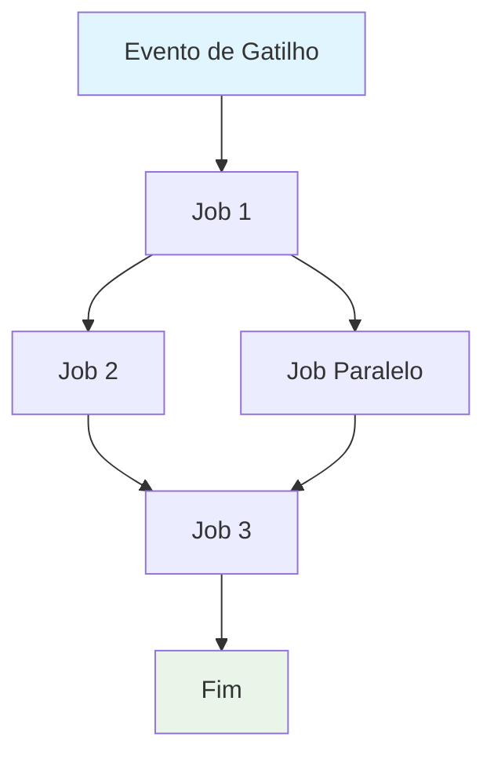
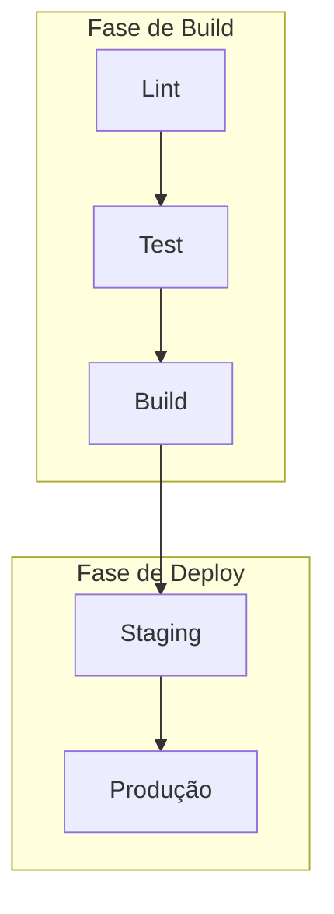

# Criar Especificação de Workflow do GitHub Actions

Crie uma especificação abrangente para o workflow do GitHub Actions: `$ARGUMENTS`.

Esta especificação serve como documentação do comportamento, requisitos e restrições do workflow. Deve ser independente de implementação, focando no **que** o workflow realiza ao invés de **como** é implementado.

## Requisitos Otimizados para IA

- **Eficiência de Tokens**: Use linguagem concisa sem sacrificar clareza
- **Dados Estruturados**: Aproveite tabelas, listas e diagramas para informações densas
- **Clareza Semântica**: Use terminologia precisa consistentemente
- **Abstração de Implementação**: Evite sintaxe, comandos ou versões específicas de ferramentas
- **Manutenibilidade**: Projete para atualizações fáceis conforme o workflow evolui

## Template de Especificação

Salvar como: `/docs/cicd/[workflow-name].md`

```md
---
title: Especificação de Workflow CI/CD - [Nome do Workflow]
version: 1.0
date_created: [YYYY-MM-DD]
last_updated: [YYYY-MM-DD]
owner: Equipe DevOps
tags: [process, cicd, github-actions, automation, [tags-específicas-do-domínio]]
---

## Visão Geral do Workflow

**Propósito**: [Uma frase descrevendo o objetivo principal do workflow]
**Eventos de Gatilho**: [Lista de condições de gatilho]
**Ambientes Alvo**: [Escopo do ambiente]

## Diagrama de Fluxo de Execução



## Jobs e Dependências

| Nome do Job | Propósito | Dependências | Contexto de Execução |
|-------------|-----------|--------------|----------------------|
| job-1 | [Propósito] | [Pré-requisitos] | [Runner/Ambiente] |
| job-2 | [Propósito] | job-1 | [Runner/Ambiente] |

## Matriz de Requisitos

### Requisitos Funcionais
| ID | Requisito | Prioridade | Critérios de Aceitação |
|----|-----------|------------|------------------------|
| REQ-001 | [Requisito] | Alta | [Critérios testáveis] |
| REQ-002 | [Requisito] | Média | [Critérios testáveis] |

### Requisitos de Segurança
| ID | Requisito | Restrição de Implementação |
|----|-----------|----------------------------|
| SEC-001 | [Requisito de segurança] | [Descrição da restrição] |

### Requisitos de Performance
| ID | Métrica | Alvo | Método de Medição |
|----|---------|------|-------------------|
| PERF-001 | [Métrica] | [Valor alvo] | [Como medir] |

## Contratos de Entrada/Saída

### Entradas

```yaml
# Variáveis de Ambiente
ENV_VAR_1: string  # Propósito: [descrição]
ENV_VAR_2: secret  # Propósito: [descrição]

# Gatilhos do Repositório
paths: [lista de filtros de caminho]
branches: [lista de padrões de branch]
```

### Saídas

```yaml
# Saídas do Job
job_1_output: string  # Descrição: [propósito]
build_artifact: file  # Descrição: [tipo de conteúdo]
```

### Secrets e Variáveis

| Tipo | Nome | Propósito | Escopo |
|------|------|-----------|--------|
| Secret | SECRET_1 | [Propósito] | Workflow |
| Variable | VAR_1 | [Propósito] | Repository |

## Restrições de Execução

### Restrições de Runtime

- **Timeout**: [Tempo máximo de execução]
- **Concorrência**: [Limites de execução paralela]
- **Limites de Recursos**: [Restrições de memória/CPU]

### Restrições Ambientais

- **Requisitos de Runner**: [Necessidades de SO/hardware]
- **Acesso à Rede**: [Necessidades de conectividade externa]
- **Permissões**: [Níveis de acesso necessários]

## Estratégia de Tratamento de Erros

| Tipo de Erro | Resposta | Ação de Recuperação |
|--------------|----------|---------------------|
| Falha de Build | [Resposta] | [Passos de recuperação] |
| Falha de Teste | [Resposta] | [Passos de recuperação] |
| Falha de Deploy | [Resposta] | [Passos de recuperação] |

## Quality Gates

### Definição de Gates

| Gate | Critérios | Condições de Bypass |
|------|-----------|---------------------|
| Qualidade de Código | [Padrões] | [Quando permitido] |
| Scan de Segurança | [Limites] | [Quando permitido] |
| Cobertura de Testes | [Percentual] | [Quando permitido] |

## Monitoramento e Observabilidade

### Métricas Chave

- **Taxa de Sucesso**: [Percentual alvo]
- **Tempo de Execução**: [Duração alvo]
- **Uso de Recursos**: [Abordagem de monitoramento]

### Alertas

| Condição | Severidade | Alvo de Notificação |
|----------|------------|---------------------|
| [Condição] | [Nível] | [Quem/Onde] |

## Pontos de Integração

### Sistemas Externos

| Sistema | Tipo de Integração | Troca de Dados | Requisitos de SLA |
|---------|-------------------|----------------|-------------------|
| [Sistema] | [Tipo] | [Formato de dados] | [Requisitos] |

### Workflows Dependentes

| Workflow | Relacionamento | Mecanismo de Gatilho |
|----------|----------------|----------------------|
| [Workflow] | [Tipo] | [Como é disparado] |

## Conformidade e Governança

### Requisitos de Auditoria

- **Logs de Execução**: [Política de retenção]
- **Gates de Aprovação**: [Aprovações necessárias]
- **Controle de Mudanças**: [Processo de atualização]

### Controles de Segurança

- **Controle de Acesso**: [Modelo de permissões]
- **Gerenciamento de Secrets**: [Política de rotação]
- **Scan de Vulnerabilidades**: [Frequência de scan]

## Casos Extremos e Exceções

### Matriz de Cenários

| Cenário | Comportamento Esperado | Método de Validação |
|---------|------------------------|---------------------|
| [Caso extremo] | [Comportamento] | [Como verificar] |

## Critérios de Validação

### Validação do Workflow

- **VLD-001**: [Regra de validação]
- **VLD-002**: [Regra de validação]

### Benchmarks de Performance

- **PERF-001**: [Critérios de benchmark]
- **PERF-002**: [Critérios de benchmark]

## Gerenciamento de Mudanças

### Processo de Atualização

1. **Atualização da Especificação**: Modifique este documento primeiro
2. **Revisão e Aprovação**: [Processo de aprovação]
3. **Implementação**: Aplique mudanças ao workflow
4. **Testes**: [Abordagem de validação]
5. **Deploy**: [Processo de release]

### Histórico de Versões

| Versão | Data | Mudanças | Autor |
|--------|------|----------|-------|
| 1.0 | [Data] | Especificação inicial | [Autor] |

## Especificações Relacionadas

- [Link para specs de workflows relacionados]
- [Link para specs de infraestrutura]
- [Link para specs de deployment]

```

## Instruções de Análise

Ao analisar o arquivo de workflow:

1. **Extrair Propósito Principal**: Identifique o objetivo de negócio primário
2. **Mapear Fluxo de Jobs**: Crie grafo de dependências mostrando ordem de execução
3. **Identificar Contratos**: Documente entradas, saídas e interfaces
4. **Capturar Restrições**: Extraia timeouts, permissões e limites
5. **Definir Quality Gates**: Identifique pontos de validação e aprovação
6. **Documentar Caminhos de Erro**: Mapeie cenários de falha e recuperação
7. **Abstrair Implementação**: Foque no comportamento, não na sintaxe

## Guidelines de Diagramas Mermaid

### Tipos de Fluxo
- **Sequencial**: `A --> B --> C`
- **Paralelo**: `A --> B & A --> C; B --> D & C --> D`
- **Condicional**: `A --> B{Decisão}; B -->|Sim| C; B -->|Não| D`

### Estilização
```mermaid
style TriggerNode fill:#e1f5fe
style SuccessNode fill:#e8f5e8
style FailureNode fill:#ffebee
style ProcessNode fill:#f3e5f5
```

### Workflows Complexos
Para workflows com 5+ jobs, use subgrafos:


## Estratégias de Otimização de Tokens

1. **Use Tabelas**: Informações densas em formato estruturado
2. **Abrevie Consistentemente**: Defina uma vez, use por todo o documento
3. **Marcadores**: Evite parágrafos em prosa
4. **Blocos de Código**: Dados estruturados ao invés de narrativa
5. **Referência Cruzada**: Use links ao invés de repetir informações

Foque em criar uma especificação que sirva tanto como documentação quanto como template para atualizações de workflows.